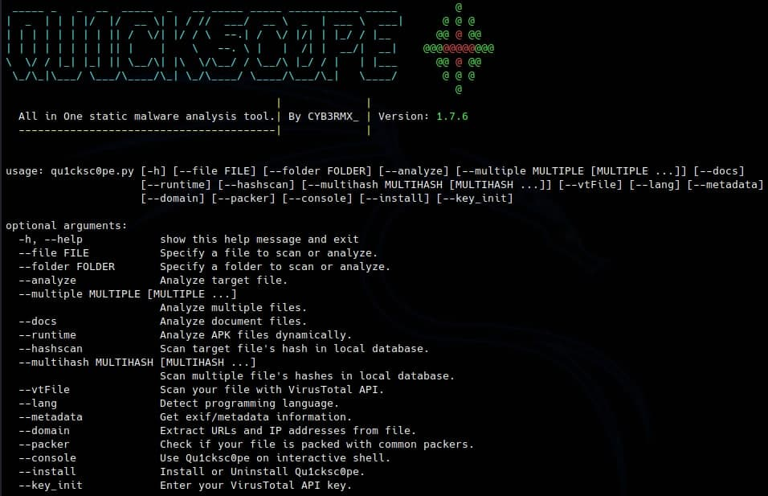
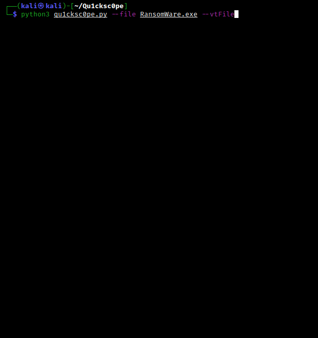

# Qu1cksc0pe
    
<br>This tool allows to statically analyze windows, linux, osx, executables and also APK files.<br>
<i>You can get</i>: 
- What DLL files are used.
- Functions and API's.
- Sections and segments.
- URL's, IP addresses and emails.
- Android permissions.

Qu1cksc0pe aims to get even more information about suspicious files and helps to user realizing what that file capable of.

- [x] Usage: ```python3 qu1cksc0pe.py --file suspicious_file --analyze```
- [x] Alternative usage: ```python3 qu1cksc0pe.py --file [PATH TO FILE] --analyze```

# Screenshot


# Updates
<b>13/09/2020</b>
- [X] Version 1.7.0 released.
- [X] Added OSX analyzer. Now Qu1cksc0pe can analyze OSX executables.

# Setup
<b>Necessary python modules</b>: ```puremagic```, ```androguard``` and ```prettytable```<br>
<b>Installation of python modules</b>: ```pip3 install -r requirements.txt```<br>
<b>Other dependencies</b>: ```VirusTotal API key```, ```binutils```, ```exiftool``` and ```aapt```.<br>
<b>Gathering other dependencies</b>
- <i>VirusTotal</i>: ```https://virustotal.com```
- <i>Binutils</i>: ```sudo apt-get install binutils```
- <i>ExifTool</i>: ```sudo apt-get install exiftool```
- <i>AAPT</i>: ```sudo apt-get install aapt```

# Scan arguments
## Normal analysis
<b>Usage</b>: ```python3 qu1cksc0pe.py --file suspicious_file --analyze```<br>


## VirusTotal
<b>Usage for --vtFile</b>: ```python3 qu1cksc0pe.py --file suspicious_file --vtFile```<br>
<b>Usage for --vtUrl</b>: ```python3 qu1cksc0pe.py --vtUrl```<br>


## Domain
<b>Usage</b>: ```python3 qu1cksc0pe.py --file suspicious_file --domain```<br><br>

